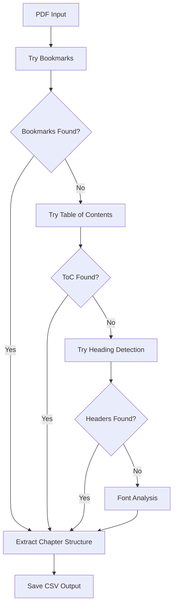

# RAG Agent System - Complete Technical Documentation

## System Overview

The RAG Agent is a sophisticated textbook search and retrieval system that processes multiple PDF textbooks, extracts chapters intelligently, creates searchable chunks, and provides semantic search capabilities. The system is designed for production use with scalability, caching, and multi-textbook support.

## 🏗️ **High-Level Architecture**

```
┌─────────────────────┐    ┌─────────────────────┐    ┌─────────────────────┐
│  Chapter Detection  │    │  Text Processing    │    │   Vector Search     │
│     System          │───▶│     Pipeline        │───▶│     Engine          │
└─────────────────────┘    └─────────────────────┘    └─────────────────────┘
         │                           │                           │
         ▼                           ▼                           ▼
    CSV Chapter Map            Document Chunks              FAISS Index
    (page boundaries)         (800 char chunks)           (384D vectors)
```

## 📁 **Directory Structure Breakdown**

### Root Directory (`RAG AGENT/`)

```
RAG AGENT/
├── key.json                     # API keys and credentials
├── pinecone-migration.md        # Migration documentation
├── chapter_detection_system/    # Chapter boundary detection
├── data_files/                  # Source PDF files
└── multi_textbook_search/       # Main search system
```

---

## 🔍 **Chapter Detection System**

**Location**: `chapter_detection_system/`

### Purpose

Automatically detects chapter boundaries in PDF files using multiple intelligent methods.

### Key Files

#### `chapter_detector.py` (376 lines)

**Core chapter detection engine with fallback methods**

```python
class ChapterDetector:
    # Method 1: Extract PDF bookmarks (highest accuracy)
    def _extract_bookmarks() -> List[Chapter]

    # Method 2: Parse Table of Contents pages
    def _parse_toc() -> List[Chapter]

    # Method 3: Detect heading patterns in text
    def _detect_headings() -> List[Chapter]

    # Method 4: Font-based analysis
    def _analyze_fonts() -> List[Chapter]
```

**Detection Methods (in priority order):**

1. **PDF Bookmarks** - Extracts built-in PDF navigation structure
2. **Table of Contents** - Parses ToC pages for chapter listings
3. **Heading Detection** - Uses regex patterns to find chapter headers
4. **Font Analysis** - Identifies chapters by font size/weight changes

**Output**: CSV file with columns: `title, start_page, end_page, pages, confidence, method`

#### `run.py`

**Simple execution script for chapter detection**

- Takes PDF path as input
- Runs detection algorithm
- Saves results to CSV in `output/` directory

#### `settings.py`

**Configuration parameters for detection algorithms**

- Font size thresholds
- Regex patterns for chapter detection
- ToC keyword lists
- Confidence scoring parameters

### How Chapter Detection Works



---

## 📚 **Multi-Textbook Search System**

**Location**: `multi_textbook_search/`

### Core Architecture (`core/` directory)

#### `models.py` (49 lines)

**Data structures for the entire system**

```python
@dataclass
class TextbookInfo:
    """Metadata for each textbook"""
    id: str                    # Unique identifier
    title: str                 # Book title
    edition: Optional[str]     # Edition info
    year: Optional[str]        # Publication year
    authors: Optional[List[str]] # Author list
    file_path: str             # PDF file path
    chapters_detected: int     # Number of chapters found
    total_chunks: int          # Total text chunks created

@dataclass
class ProcessingResult:
    """Result of processing a textbook"""
    textbook_info: TextbookInfo
    documents: List[Document]   # Chunked text documents
    processing_time: float     # Time taken to process
    success: bool              # Success/failure flag
    error_message: Optional[str]

class TextbookCollection:
    """Container for multiple processed textbooks"""
    textbooks: Dict[str, TextbookInfo]  # Registry of textbooks
    all_documents: List[Document]       # All chunks from all books
```

#### `processor.py` (280 lines)

**Main text processing and chunking engine**

```python
class ProductionTextbookProcessor:
    def __init__(self, chunk_size=800, chunk_overlap=100):
        # RecursiveCharacterTextSplitter for intelligent chunking
        self.text_splitter = RecursiveCharacterTextSplitter(
            chunk_size=800,           # Target chunk size
            chunk_overlap=100,        # Overlap between chunks
            separators=["\n\n", "\n", " ", ""]  # Split priorities
        )
```

**Key Methods:**

1. **`load_chapter_data(csv_path)`**

   - Loads chapter boundaries from CSV (created by chapter detection)
   - Parses: title, start_page, end_page, confidence, method

2. **`process_textbook(textbook_info, pdf_path, chapter_csv_path)`**

   - Main orchestration method
   - Loads chapter data → Extracts text → Creates chunks → Returns ProcessingResult

3. **`_extract_text_from_pdf_with_chapters(pdf_path, chapters, textbook_info)`**

   - Uses PyPDF2 for text extraction
   - Processes each chapter based on page boundaries
   - Extracts text page by page within chapter ranges
   - Handles extraction errors gracefully

4. **`_create_chapter_chunks(chapter_text, chapter_title, start_page, end_page, textbook_info)`**
   - Splits chapter text into 800-character chunks with 100-char overlap
   - Adds comprehensive metadata to each chunk:
     ```python
     metadata = {
         'textbook_id': textbook_info.id,
         'textbook_title': textbook_info.title,
         'chapter': chapter_title,
         'page_range': f"{start_page}-{end_page}",
         'chunk_index': chunk_num,
         'source_file': os.path.basename(pdf_path)
     }
     ```

#### `search_engine.py` (215 lines)

**Vector search engine with FAISS and caching**

```python
class ProductionSearchEngine:
    def __init__(self, model_name="all-MiniLM-L6-v2", cache_dir="data"):
        # Sentence transformer for embeddings (384 dimensions)
        self.model = SentenceTransformer(model_name)
        self.embedding_dim = 384

        # FAISS index for fast similarity search
        self.faiss_index = None
        self.documents = []
        self.embeddings = None
```

**Key Methods:**

1. **`build_index_from_collection(collection)`**

   - Builds searchable index from TextbookCollection
   - Tries to load cached index first (for speed)
   - Falls back to building fresh index if needed

2. **`_build_fresh_index(documents, cache_path)`**

   - Generates 384D embeddings for all document chunks
   - Creates FAISS IndexFlatIP (inner product for cosine similarity)
   - Normalizes embeddings for cosine similarity
   - Caches everything to pickle file

3. **`search(query, top_k=5, textbook_filter=None)`**
   - Generates query embedding
   - Searches FAISS index for similar documents
   - Supports filtering by textbook
   - Returns formatted results with scores and metadata

**Caching Strategy:**

- Saves complete index to: `faiss_semantic_search_vectors_384d.pkl`
- Cache includes: documents, embeddings, FAISS index, metadata
- Dramatically speeds up subsequent runs

---

## 🚀 **Production Pipeline Files**

### `optimized_pipeline.py` (205 lines)

**Scalable textbook management system**

```python
class OptimizedTextbookManager:
    """Manages textbooks with separate files for optimal performance"""
```

**Key Features:**

- **Separate Files**: Each textbook stored in individual pickle file
- **Registry System**: Central metadata registry (`textbook_registry.pkl`)
- **Memory Efficiency**: Only loads needed textbooks into memory
- **Incremental Updates**: Can add/remove textbooks without rebuilding everything

**File Structure:**

```
data/
├── textbook_registry.pkl           # Central registry
├── textbooks/
│   ├── nursing_skills_chunks.pkl   # Individual textbook chunks
│   └── emergency_medicine_chunks.pkl
└── faiss_semantic_search_vectors_384d.pkl  # Search index
```

### `production_search.py` (125 lines)

**User-facing search interface**

```python
def quick_search(query: str, top_k: int = 3, textbook_filter: str = None):
    """Production search with intelligent fallbacks"""
```

**Fallback Strategy:**

1. Try optimized structure (separate files per textbook)
2. Fall back to legacy unified file
3. Fall back to single textbook mode

### Utility Scripts

#### `view_textbooks.py`

- Lists all processed textbooks
- Shows statistics (chapters, chunks, processing time)
- Displays textbook metadata

#### `delete_textbook.py`

- Removes textbook from registry
- Deletes associated chunk files
- Rebuilds search index

#### `inspect_faiss_index_full.py`

- Analyzes FAISS index structure
- Shows embedding statistics
- Validates index integrity

---

## 🔄 **Complete System Workflow**

### Step 1: Chapter Detection

```bash
cd chapter_detection_system
python run.py "../data_files/textbook.pdf"
```

**Output**: `output/textbook_chapters.csv`

### Step 2: Text Processing & Chunking

```python
# In optimized_pipeline.py or custom script
processor = ProductionTextbookProcessor()
result = processor.process_textbook(
    textbook_info=TextbookInfo(...),
    pdf_path="data_files/textbook.pdf",
    chapter_csv_path="chapter_detection_system/output/textbook_chapters.csv"
)
```

### Step 3: Index Building

```python
search_engine = ProductionSearchEngine()
search_engine.build_index_from_collection(collection)
```

### Step 4: Search

```python
results = search_engine.search("diabetes treatment", top_k=5)
```

---

## 💾 **Data Storage Strategy**

### File Organization

```
data/
├── textbook_registry.pkl                 # Central metadata
├── faiss_semantic_search_vectors_384d.pkl # Search index cache
└── textbooks/
    ├── nursing_skills_2e_chunks.pkl      # Individual textbook data
    └── emergency_medicine_chunks.pkl
```

### Cache Files

- **Vector Cache**: Prevents re-embedding documents (expensive operation)
- **Index Cache**: FAISS index saved to disk for instant loading
- **Document Cache**: Processed chunks stored per textbook

---

## 🔧 **Key Technologies**

### PDF Processing

- **PyMuPDF (fitz)**: Chapter detection, font analysis
- **PyPDF2**: Text extraction from PDF pages

### Text Processing

- **LangChain**: Document chunking with RecursiveCharacterTextSplitter
- **Regex**: Pattern matching for chapter detection

### Vector Search

- **Sentence Transformers**: "all-MiniLM-L6-v2" model (384D embeddings)
- **FAISS**: Fast similarity search with IndexFlatIP
- **NumPy**: Vector operations and normalization

### Data Management

- **Pickle**: Serialization for caching and storage
- **CSV**: Chapter boundary data exchange
- **Python Dataclasses**: Type-safe data structures

---

## 🎯 **System Strengths**

1. **Intelligent Chapter Detection**: Multiple fallback methods ensure chapters are found
2. **Scalable Architecture**: Separate files per textbook, cached indexes
3. **Production Ready**: Error handling, logging, graceful fallbacks
4. **Metadata Rich**: Comprehensive tracking of textbook, chapter, and chunk information
5. **Fast Search**: FAISS indexing with caching for sub-second searches
6. **Flexible**: Supports single or multi-textbook workflows

---

## 🚀 **Performance Characteristics**

### Processing Speed

- **Chapter Detection**: ~30 seconds per textbook
- **Text Extraction**: ~1-2 minutes per textbook (depends on size)
- **Embedding Generation**: ~10-30 seconds per textbook
- **Search**: <100ms per query (after index is built)

### Memory Usage

- **Per Textbook**: ~50-200MB during processing
- **Search Index**: ~100-500MB for multiple textbooks
- **Runtime**: ~200-500MB for active search engine

### Storage

- **Source PDFs**: 10-100MB each
- **Processed Chunks**: ~10-50MB per textbook
- **Search Index**: ~50-200MB
- **Total**: ~100MB-1GB for full system

---

## 🔄 **Current State & Next Steps**

### What's Working

✅ Chapter detection with high accuracy  
✅ Multi-textbook processing pipeline  
✅ Fast semantic search with FAISS  
✅ Production-ready caching system  
✅ Comprehensive metadata tracking

### Migration to Pinecone

📋 **Migration guide created** in `pinecone-migration.md`  
🎯 **Zero changes** to text processing  
🔄 **Only search engine layer** needs updating  
☁️ **Cloud scalability** and collaboration benefits

This system is production-ready and well-architected for scaling to hundreds of textbooks with minimal performance impact.
