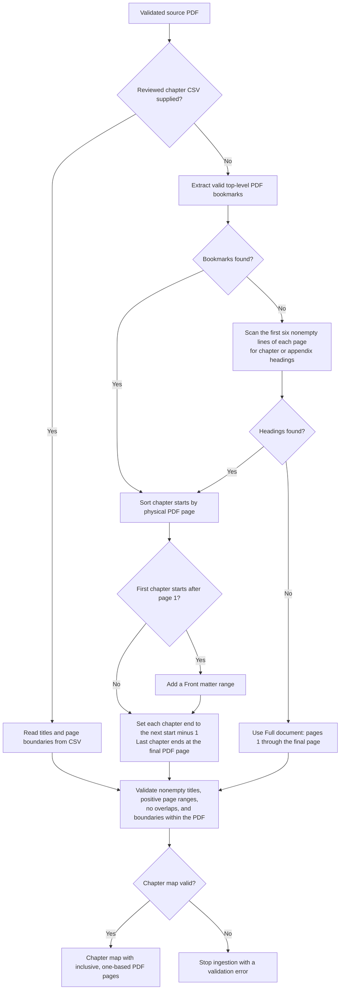
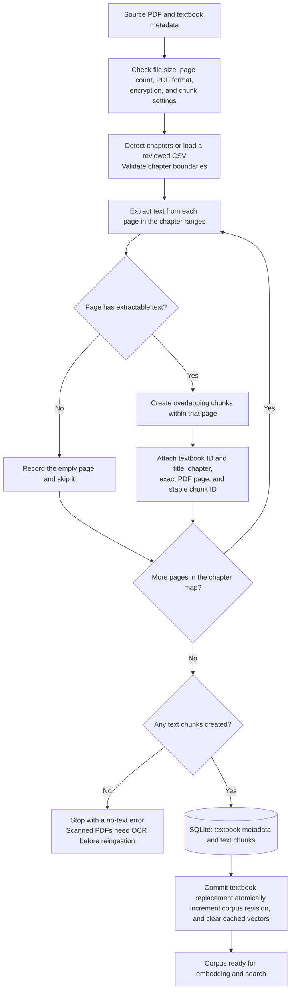
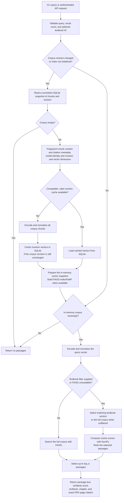

# Medical RAG Engine

[](https://github.com/Wasif0410/medical-rag-engine/actions/workflows/ci.yml)

Chapter-aware ingestion and cited semantic retrieval for medical textbooks. Turn text-based PDFs into a searchable corpus, retrieve relevant passages, and preserve the textbook, chapter, and physical PDF page behind every result.

The engine provides the retrieval layer for RAG applications. It returns source passages rather than generated answers. It has no LLM provider credentials or clinical decision-making features.

## What it does

- Detects chapters from bookmarks or explicit headings; accepts reviewed chapter CSVs.
- Creates overlapping chunks within each PDF page for exact page citations.
- Stores textbooks and passages in SQLite with transactional replacement and deletion.
- Uses a pinned Sentence Transformers model and FAISS for cosine similarity search.
- Filters textbooks before ranking, and invalidates cached vectors when the corpus changes.
- Exposes a JSON CLI and an authenticated, read-only FastAPI service.
- Includes a lockfile, regression tests, real-model integration test, CI, and a non-root Docker image.

## How it works

The pipeline has three stages: determine chapter boundaries, ingest passages with page provenance, and retrieve the closest passages to a query. These flowcharts show the current implementation, including detection fallbacks and vector-cache reuse.

### 1. Chapter detection flow

During ingestion, a reviewed chapter CSV takes precedence over automatic detection. Automatic detection tries valid top-level PDF bookmarks first, then explicit chapter or appendix headings in the first six nonempty lines of each page. If neither produces boundaries, the entire PDF becomes one chapter.



`medical-rag detect` runs the automatic branch and writes a CSV for review. `medical-rag ingest --chapters ...` loads the reviewed CSV. Printed tables of contents should be converted into a reviewed map because their printed page labels can differ from physical PDF pages. Bookmarks carry confidence `0.9`, heading detection `0.6`, and fallback ranges `0.0`; these describe the detection method rather than clinical reliability.

### 2. PDF ingestion and storage flow

Ingestion extracts each physical page independently. By default, text is split into chunks of up to 800 characters with 100-character overlap, keeping every chunk on its source page.



Source PDFs remain separate files. SQLite holds the extracted corpus and cached numeric vectors in `data/corpus.sqlite3`. Failed ingestion or replacement leaves the previous stored textbook intact. Ingestion itself does not load the embedding model; `medical-rag index`, search, or API startup prepares the search index.

### 3. Vector preparation and search flow

The same pinned embedding model encodes corpus passages and queries. Search refreshes its corpus snapshot when the stored revision changes, reuses a compatible numeric cache when available, and ranks results by cosine similarity.



**SQLite stores the vectors; FAISS searches them in memory.** Filtered searches rank only the matching textbook's vectors using NumPy, so relevant matches cannot be lost through fixed overfetch limits. Legacy `.pkl` caches are not loaded. Replacing or deleting a textbook invalidates the numeric cache, and the next search refreshes the in-memory snapshot. See [architecture](docs/architecture.md) for concurrency and cache details.

## Quickstart

Requires Python 3.11–3.13 and [uv](https://docs.astral.sh/uv/getting-started/installation/). Run these commands from the repository root:

```sh
git clone https://github.com/Wasif0410/medical-rag-engine.git
cd medical-rag-engine
uv sync --locked --all-extras
uv run --all-extras python examples/create_sample_pdf.py
uv run --all-extras medical-rag ingest data/sample.pdf --id sample --title "Synthetic Clinical Textbook"
uv run --all-extras medical-rag index
uv run --all-extras medical-rag search "burn wound assessment" --top-k 3
```

The sample PDF is synthetic material for software testing. The first `index` or `search` downloads the pinned embedding model; ingestion alone needs no model or network access. Linux and Windows use CPU-only PyTorch wheels through uv.

Search results are JSON objects containing `content`, `score`, `textbook_id`, `textbook_title`, `chapter`, `page`, `citation`, and `chunk_id`. The score is cosine similarity, not a probability or a measure of clinical correctness.

### Ingest your own textbook

Use a PDF you have permission to process. Review detected chapters before ingestion when the PDF has unreliable bookmarks:

```sh
uv run --all-extras medical-rag detect path/to/book.pdf --output data/chapters.csv
uv run --all-extras medical-rag ingest path/to/book.pdf --id book-v1 --title "Textbook Title" --edition "2nd edition" --chapters data/chapters.csv
uv run --all-extras medical-rag search "your question" --textbook book-v1
uv run --all-extras medical-rag list
uv run --all-extras medical-rag delete book-v1 --yes
```

CSV columns are `title,start_page,end_page`, with optional `method,confidence`. All page boundaries are **one-based physical PDF pages**, inclusive. Printed page labels can differ. Omit `--chapters` to detect automatically; detection falls back to the full document when no chapter headings are found. CSV ranges may omit pages intentionally, but must not overlap or exceed the PDF.

Ingesting an existing ID replaces that textbook atomically. No command silently loads old pickle files. See [migration guidance](docs/migration.md) for the previous repository layout.

## Run the API

Copy `.env.example` to `.env`, generate a key, and put it in `MEDICAL_RAG_API_KEY`:

```sh
uv run --all-extras python -c "import secrets; print(secrets.token_urlsafe(32))"
uv run --all-extras --env-file .env uvicorn medical_rag.api:create_app --factory --host 127.0.0.1 --port 8000 --workers 1 --limit-concurrency 32 --no-access-log
```

The API requires a key of at least 32 characters. It loads the model and warms the corpus index during startup. Create the corpus first using the quickstart. `GET /healthz` checks liveness; `GET /readyz` returns 503 for an empty corpus. These endpoints expose no passages.

```sh
curl -X POST http://127.0.0.1:8000/v1/search \
  -H "Content-Type: application/json" \
  -H "X-API-Key: <your-api-key>" \
  -d '{"query":"burn wound assessment","top_k":3,"textbook_id":"sample"}'
```

The response contains `results` and a `request_id`. Requests allow 1–2,000 query characters, 1–100 results, and at most 16 KiB of JSON. The API has no upload or delete endpoints. Place it behind HTTPS, gateway rate limits, and access controls for remote deployments; see [operations](docs/operations.md).

### Docker

After setting the API key in `.env`:

```sh
docker compose build
docker compose run --rm api python /app/examples/create_sample_pdf.py --output /data/sample.pdf
docker compose run --rm api medical-rag ingest /data/sample.pdf --id sample --title "Synthetic Clinical Textbook"
docker compose run --rm api medical-rag index
docker compose up -d
```

The image contains the pinned model and serves without downloading it at runtime. Compose uses a persistent corpus volume, a read-only root filesystem, a non-root user, and a localhost port binding. Source PDFs and generated data are excluded from the image build context.

## Project layout

```text
src/medical_rag/
  models.py         Domain types and citations
  chapters.py       Detection and chapter CSV validation
  chunking.py       Page-local text splitting
  ingestion.py      PDF extraction and provenance
  storage.py        SQLite corpus transactions and vector persistence
  embeddings.py     Lazy Sentence Transformers adapter
  search.py         Cache invalidation, cosine ranking, and filtering
  config.py         Environment settings and validation
  service.py        Production dependency construction
  cli.py            JSON command-line interface
  api.py            Authenticated HTTP retrieval
  http_limits.py    Bounded HTTP request bodies
tests/              Offline regressions and opt-in real-model verification
examples/           Synthetic PDF generator
docs/               Architecture, migration, and deployment guidance
```

## Development

```sh
uv sync --locked --all-extras
uv run --all-extras ruff check src tests examples
uv run --all-extras ruff format --check src tests examples
uv run --all-extras pytest -m "not integration"
uv build
```

Set `MEDICAL_RAG_RUN_INTEGRATION=true` and run `uv run --all-extras pytest -m integration` to test the real embedding model, FAISS, offline cache reuse, and authenticated API together. CI tests Linux and Windows on Python 3.11–3.13, audits runtime dependencies, and builds and smoke-tests the container. See [CONTRIBUTING.md](CONTRIBUTING.md).

## Scope and limitations

This is a deployment-oriented retrieval foundation for controlled corpora. Retrieval quality depends on extraction, chapter maps, source quality, and embedding choice; the default model is general-purpose and has not been validated for clinical use. Scanned pages need OCR before ingestion. Text extraction does not reconstruct tables or images. PDF parsing should run in an isolated ingestion environment for untrusted documents.

The engine holds the full corpus and vectors in memory and rebuilds corpus embeddings after changes. It targets small to medium collections on one host, not distributed search. A single API worker serializes inference; gateway timeouts and rate limits remain deployment responsibilities. There is no answer generation, medical accuracy evaluation, or compliance certification.

The repository does not currently declare a project license. Third-party dependencies retain their own licenses; [PyMuPDF offers AGPL and commercial terms](https://pymupdf.io/licensing). Resolve licensing and source-document rights before redistribution. No patient records, private textbooks, or credentials belong in Git.

Read [architecture](docs/architecture.md), [operations](docs/operations.md), [migration](docs/migration.md), and [security](SECURITY.md) for implementation details and deployment boundaries.
