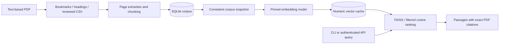

# Architecture

Medical RAG Engine separates document ingestion, persistence, embedding inference, retrieval, and delivery. Domain dataclasses do not depend on LangChain or a web framework.

## Page provenance

Chapter ranges are one-based, inclusive physical PDF pages. PyMuPDF page indexes are zero-based; conversion happens only at extraction. Each chunk belongs to one page, so citations never estimate a page from chunk position. Page-local chunking trades some cross-page context for reliable provenance.

Detection prefers top-level bookmarks, then explicit chapter or appendix headings near the beginning of a page. Front matter gets a fallback range. If no boundary is found, the full PDF becomes one range. Printed tables of contents are not interpreted automatically because page labels and physical page numbers may differ. Review the CSV for each corpus.

## Persistence and concurrency

SQLite owns textbooks, chunks, the corpus revision, and embedding caches. Foreign keys cascade textbook deletion. A replacement deletes and inserts within one transaction, so failed insertions restore the previous corpus. WAL mode allows readers to continue during writes, with a 30-second SQLite lock timeout. Connections belong to individual operations and are closed after use.

A read transaction captures ordered chunks and the corpus revision together. Search publishes its in-memory index only after the entire snapshot is built. A concurrent update can leave one in-flight query using the previous consistent snapshot; subsequent queries detect the changed revision and refresh. Corpus writes are performed by the CLI rather than HTTP requests.

## Cache identity and safety

The cache fingerprint includes model identity and revision, embedding dimension, every chunk's text and citation metadata, and the cache schema. Cache reuse is never based on a filename or document count. Replacing or deleting a textbook clears persisted vectors. A build from an older corpus revision cannot overwrite the current cache.

Vectors use NumPy's numeric format with `allow_pickle=False`, stored as SQLite BLOBs. Loading validates dtype, shape, finite values, and nonzero norms. Corrupt or incompatible vectors are rebuilt. FAISS indexes are reconstructed in memory from validated vectors; no arbitrary Python objects or serialized FAISS indexes are loaded from disk.

The default model revision is pinned and uses safetensors; remote model code is disabled. Alternative models should also use an immutable revision. Local model directories must be immutable between runs because the configured path forms part of model identity.

## Search behavior

Embeddings are normalized and ranked by cosine similarity. FAISS IndexFlatIP serves unfiltered queries. Textbook filtering selects the matching vector subset before ranking, which avoids recall loss from fixed overfetch windows. Requested result counts are capped at the corpus size; invalid FAISS sentinel indexes never become results. Exact NumPy ranking is also available when FAISS is absent, primarily for small corpora and offline tests.

Each engine serializes refresh and inference with a lock. It refreshes when the corpus revision changes, loading cached vectors or recomputing the full corpus. Large collections or frequent writes need a different indexing strategy and storage backend.

## Interfaces

The CLI provides detect, ingest, index, search, list, and delete. Successful output is JSON on stdout; diagnostics go to stderr and failures return nonzero status. The API exposes read-only search plus health checks. Dependency construction is lazy and injectable, allowing deterministic unit tests and a separate real-model integration test.

Implementation follows the primary [PyMuPDF page and bookmark APIs](https://pymupdf.readthedocs.io/en/latest/document.html), [Sentence Transformers inference API](https://www.sbert.net/docs/package_reference/sentence_transformer/model.html), and [FastAPI lifespan model](https://fastapi.tiangolo.com/advanced/events/).
